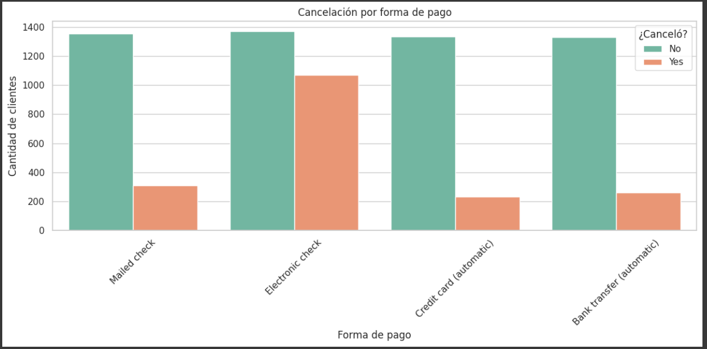
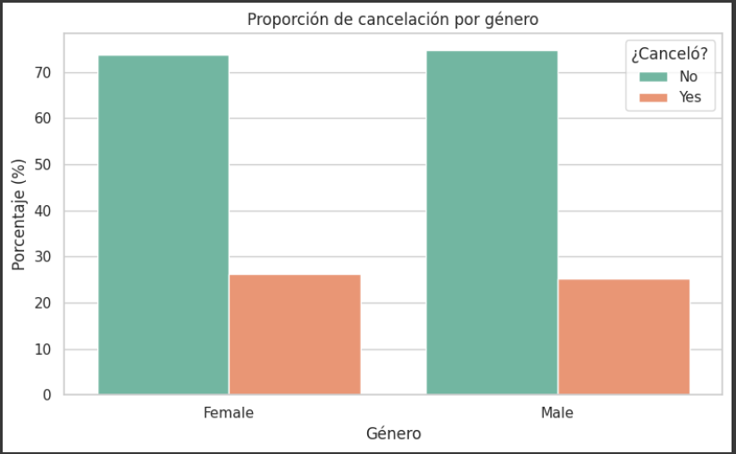
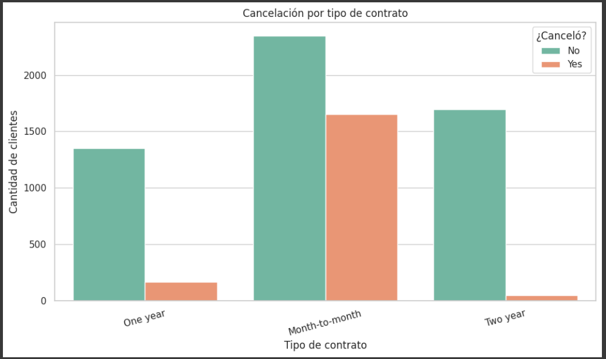
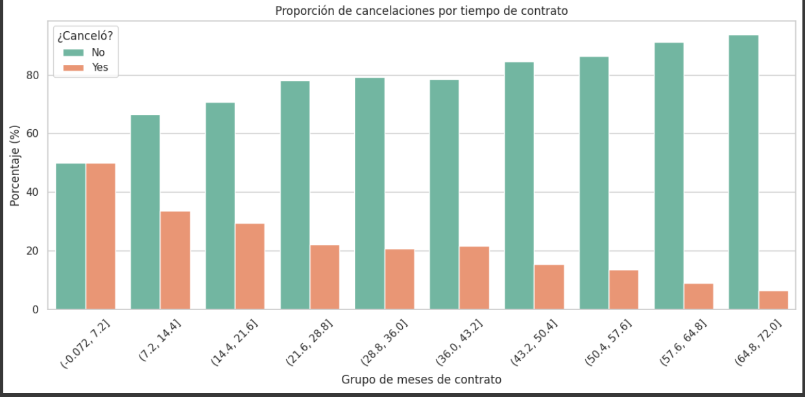

# TelecomX-EDA
# 📊 Telecom X - Análisis de Evasión de Clientes

Este proyecto realiza un **Análisis Exploratorio de Datos (EDA)** sobre los clientes de la empresa ficticia **Telecom X**, que enfrenta una alta tasa de cancelación de servicios. El objetivo es identificar factores que influyen en el *churn* (evasión) de clientes y generar insights que puedan apoyar estrategias de retención.

---

## 🧠 Propósito del Análisis

- Identificar las variables más asociadas al abandono de clientes.
- Visualizar tendencias y relaciones clave en el comportamiento del cliente.
- Proveer información útil para modelos predictivos y decisiones de negocio.

---

## 📁 Estructura del Proyecto

```
TelecomX-Churn-EDA/
├── TelecomX_EDA_Churn.ipynb # Notebook principal con análisis completo
└── README.md # Este archivo, con descripción y guía de uso
```

---

## 🛠️ Herramientas Utilizadas

- **Python 3** (Google Colab)
- **Pandas** y **NumPy** → Manipulación de datos
- **Matplotlib** y **Seaborn** → Visualización
- **Requests** → Extracción de datos desde API pública (formato JSON)
- **Google Colab** → Desarrollo y visualización en la nube

---

## 📈 Ejemplos de Análisis y Gráficos Incluidos

- 📌 **Tipo de contrato vs Cancelación**  
  Los contratos mensuales presentan mayor tasa de evasión.

- 📌 **Forma de pago**  
  Pagos automáticos están asociados a menor probabilidad de cancelación.

- 📌 **Tiempo de permanencia**  
  Clientes con menor antigüedad cancelan con mayor frecuencia.

- 📌 **Género del cliente**  
  No se observan diferencias significativas entre hombres y mujeres.

> Todos estos análisis están ilustrados con gráficos claros y personalizables.
> 
### 📊 Ejemplo de gráfico:  

Gráfico de cancelacion forma de pago:




Cancelación por género:




Cancelación por tipo de contrato:



Cancelación por tiempo de contrato:




---

## 📋 Cómo Ejecutar el Notebook

1. **Abrir** el archivo [`TelecomX_EDA_Churn.ipynb`](TelecomX_EDA_Churn.ipynb) en [Google Colab](https://colab.research.google.com/).
2. **Verificar conexión a internet**, ya que los datos se cargan directamente desde una URL externa.
3. **Ejecutar todas las celdas** en orden para reproducir el análisis.
4. Puedes **modificar el código** para incluir nuevas variables, métricas o visualizaciones.

> 💡 Consejo: Guarda una copia en tu Google Drive antes de editarlo si estás trabajando desde Colab.

---

## ✅ Conclusiones del Análisis

- El tipo de contrato y el método de pago son variables críticas para predecir cancelaciones.
- La permanencia del cliente también es un fuerte indicador de riesgo.
- El análisis ofrece una base sólida para avanzar hacia modelos de Machine Learning que permitan predecir la cancelación antes de que ocurra.

---

## 👩‍💻 Autora

**Beatriz Suyo**  
[GitHub: @BeatrizSuyo](https://github.com/BeatrizSuyo)

Proyecto realizado como parte del curso de **Data Science** aplicado al análisis de cancelación de clientes.  

